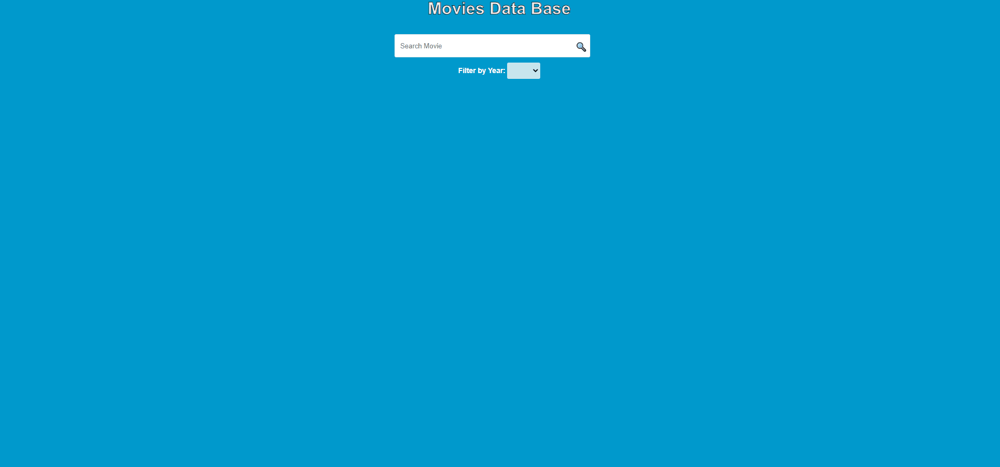
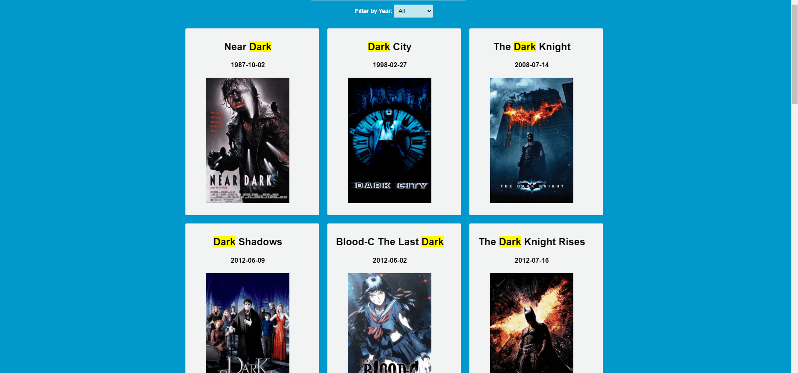

# Movies Data Base

A small website to display movies by search query.
Developed with pure HTML, CSS and Javascript.

## Table of Contents

[1. Search Query](#Search_Query) 
[2. Filter by Year](#Filter_by_Year) 
[3. Responsive Design](#Responsive_Design) 
[4. Pagination](#Pagination) 
[5. Movie Description](#Movie_Description) 

<a name="Search_Query">

### 1. Search Query

Each time the user starts to write something at the search bar he\she gets the results right away. 
As you might notice the search word highlighted for each movie title and the results are sorted by ascending release date: 

<a name="Filter_by_Year">

### 2. Filter by Year

If you wish, you have the option to see only the movies released at specific year. 
The years you see at the drop down are the only ones related to the search query.

<a name="Responsive_Design">

### 3. Responsive Design

As you can see the design adapts and fits to different kind of screens:   

<a name="Pagination">

### 4. Pagination

The query can return several pages to specific search, so you have the option to jump among all of the pages:   

<a name="Movie_Description">

### 5. Movie Description

Another feature that I added is that you can view the movie description if you go over the movie with the mouse:   

